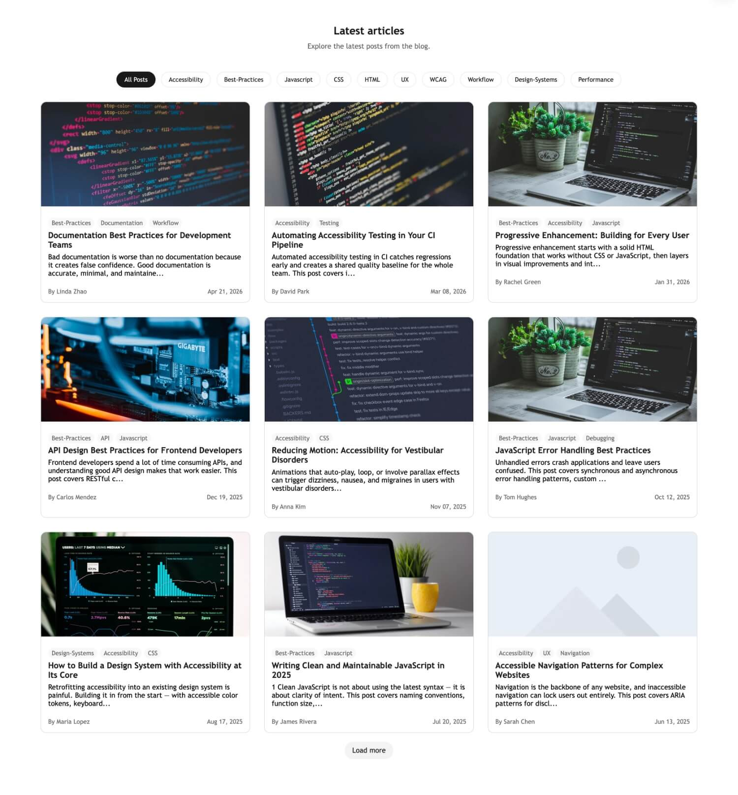

# HubSpot Filterable Blog Listing Module for Blog Templates

HubSpot CMS module for a HubSpot blog template with a filterable blog listing, load-more pagination, post cards, and editor-controlled content and style options. 

## Overview

This module is designed to give editors a flexible blog listing that can be filtered by tags, loaded in batches, and styled without changing the template code.

## Key Features

- Responsive blog card grid for desktop and mobile
- Tag-based filtering powered by HubSpot blog tags
- Load more interaction for progressive content loading
- Editor-friendly content fields for headings, labels, and empty states
- Module-scoped styling via HubL and CSS custom properties

## Load More — Technical Approach

The load more interaction uses HubSpot's native blog pagination URLs instead of
an external API or serverless function, keeping the solution self-contained
within the CMS.

### How it works

When the user clicks "Load more", the module fetches the next paginated blog URL
(`/blog/page/2`, `/blog/page/3`, etc.) as a full HTML document, parses it with
`DOMParser`, extracts only the `.blog-post-card` elements, and appends them to
the existing grid — no page reload, no API key required.

Tag filtering works the same way: selecting a tag fetches
`/blog/tag/tag-slug/page/1`, replaces the current cards with the first page of
filtered results, and resets the pagination counter.

### Why this approach

- Works entirely within HubSpot CMS — no serverless function or private app token needed
- Reuses HubSpot's own rendered markup, so cards are always consistent with the
  server-side output
- Total page count is read from the `data-pages` attribute on the load more
  button (set by HubL at render time), so the module knows exactly when to hide
  the button without an extra API call

### State managed by the module

| Variable | Purpose |
|---|---|
| `currentPage` | Tracks which paginated URL to fetch next |
| `selectedTag` | Tracks the active tag filter slug |
| `fetching` | Prevents duplicate requests on rapid clicks |
| `blogOutOfPosts` | Hides the button once all pages are loaded |
| `totalPages` | Read from HubL at render, updated on filter change |

## Accessibility

- Semantic markup for articles, lists, and controls
- `aria-busy`, `aria-live`, and alert messaging for async updates
- Keyboard-accessible buttons for filters and pagination
- Visible focus styles for interactive elements

## Technologies

- HubL
- HTML
- CSS
- JavaScript

## Installation

1. Add the module folder to your HubSpot theme modules directory.
2. Upload the theme or module to your HubSpot account.
3. Add the module to a blog listing template.
4. Configure the content, filter, and style fields in the editor.

## Module Structure

- `modules/filterable-blog-listing.module/module.html` -> handles the HubL render output and markup structure.
- `modules/filterable-blog-listing.module/module.css` -> contains the component styles and responsive layout.
- `modules/filterable-blog-listing.module/module.js` -> manages filtering, load-more behavior, and state updates.
- `modules/filterable-blog-listing.module/fields.json` -> defines editor controls for content and style.
- `modules/filterable-blog-listing.module/meta.json` -> registers the module in HubSpot.

## Customization

Main configurable areas include:

- Heading content
- Filter labels and tag limit
- Card image, tags, summary, author, and date visibility
- Load more, loading, end-state, and error messages
- Card and button colors

## Responsive Behavior

- The grid collapses to a single column on small screens.
- It expands to two and three columns at wider breakpoints.
- Filtering and loading use the same card structure, so the interaction remains consistent across sizes.

## Why This Project

This module is intended to stay maintainable for long-term client work:

- Editors can control the content without touching code.
- Styling is isolated to the module to avoid theme-wide side effects.
- JavaScript stays local to the module so the behavior is easy to reason about.
- The structure is simple enough to extend later if more blog controls are needed.

## Preview

## Author

Developed by **Javier Fuentes**

- GitHub: https://github.com/Javierismo